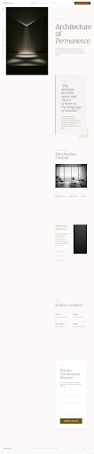

# Luxury Real Estate Architectural Landing Page

<div align="center">
  
</div>

## Overview

| Property | Value |
|----------|-------|
| **Difficulty** | :orange_circle: Intermediate–Advanced |
| **Build Time** | 4–6 hours |
| **Commercial Value** | $4,000 – $10,000 |
| **Tech Stack** | HTML, CSS, JavaScript, Tailwind CSS CDN, Intersection Observer API |
| **AI Tools Used** | Claude |
| **Live Demo** | Coming Soon |

## What You'll Build

A premium luxury real estate / architectural firm landing page featuring a **split-screen scroll-narrative layout** — a sticky visual panel on the left that silently swaps cinematic images as the user scrolls through editorial "chapters" on the right. The experience feels like turning the pages of an architectural monograph rather than scrolling a website.

Sections include:
- A fixed frosted-glass top nav with "Private Consultation" CTA
- A fixed vertical side-nav (desktop) with icon + rotated label
- A sticky left visual stage cycling through 4 architectural images
- 6 narrative chapters: Manifesto, Design Philosophy, Signature Commission, Material & Craft, Global Presence, and a Private Commission inquiry form
- Elegant footer with minimal legal links

This is the kind of high-concept, editorial experience that luxury real estate developers, architectural studios, and high-end property brands pay **$4,000–$10,000** for.

## What You'll Learn

- **Split-screen sticky layout** — left panel sticks to viewport while right content scrolls freely
- **Intersection Observer API** — detect which chapter is in view and swap images without any library
- **CSS transition choreography** — opacity + scale transitions that create a cinematic "visual breathe" effect
- **Scroll-driven narrative design** — structuring content as editorial chapters that guide the reader
- **Tailwind CSS (CDN)** — full design system with custom colors, fonts, and zero-radius borders
- **Floating label form inputs** — CSS-only animated labels using the `peer` utility
- **Material Symbols** — lightweight Google icon font for UI accents
- **Responsive design** — collapsing from split-screen desktop to stacked mobile layout

## Tech Stack Details

| Technology | Version | Purpose |
|------------|---------|---------|
| Tailwind CSS | CDN (latest) | Utility-first styling + design system |
| Google Fonts | — | Noto Serif (display) + Manrope (body) |
| Material Symbols | — | Icon accents in side nav and lists |
| Intersection Observer | Native | Chapter detection → visual swap |

## Design System

| Token | Value | Usage |
|-------|-------|-------|
| `primary` | `#775a19` | Gold/amber — accents, borders, active states |
| `primary-container` | `#c5a059` | Hover states, selection backgrounds |
| `surface` | `#fcf9f8` | Page background (warm off-white) |
| `on-surface` | `#1c1b1b` | Primary text |
| `on-surface-variant` | `#4e4639` | Secondary/body text |
| `outline-variant` | `#d1c5b4` | Subtle dividers |
| Font: Headline | Noto Serif | All editorial headings, nav brand name |
| Font: Body | Manrope | All UI text, labels, captions |

## Prerequisites

- Basic knowledge of HTML and CSS
- Familiarity with JavaScript (functions, DOM queries)
- A code editor (VS Code recommended)
- A local server (Live Server extension or `npx serve`)
- An AI assistant (Claude, ChatGPT, or Cursor)
- 4–6 high-quality architectural/real estate images (see Step 1 for free sources)

## Project Structure

```
luxury-real-estate-architectural/
├── index.html          # Complete page: nav, side-nav, split layout, 6 chapters, form, footer
├── style.css           # Custom properties, base styles, animations not covered by Tailwind
└── app.js              # IntersectionObserver chapter tracker + visual swap logic
```

## Get Started

Follow the full tutorial in **[BLUEPRINT.md](BLUEPRINT.md)**.
